# Hammerspoon Configuration Framework

A modular Hammerspoon configuration framework focused on providing as many usefull keyboard shortcuts as possible. All the main features I NEED on my Macbook.

## Overview

| Module | Description |
| --- | --- |
| **Application Management** | Quick app opening and switching with dedicated shortcuts for each app |
| **Window Management** | Fast window positioning and management with keyboard shortcuts |
| **Internal Clipboard History** | Paste recent items directly with keyboard shortcuts, even supporting images |
| **Fabric AI Integration** | AI integration for features like, correct, improve, fact-check, convert to LaTeX and many more |
| **Macro Recording & Editor** | Record mouse/keyboard, edit timing in a visual editor, and play back |
| **Mouse Speed Finder** | Analyze pointing performance and suggest/apply optimal mouse/trackpad speed |
| **Kanata Integration** | Visual menu bar indicator for Kanata keyboard layers |
| **Telemetry (Optional)** | Local hotkey usage tracking with optional server POST |
| **Finder Integration** | Open the current folder in Terminal or Editor with keyboard shortcut |

## Project Structure

```
~/.hammerspoon/
├── init.lua                     # Main entry point
├── config_defaults.lua          # Default configuration (don't edit)
├── config_user.lua              # User configuration (edit this)
├── config_user.lua.template     # Template for user configuration
├── self.lua                     # Custom user functions
├── setup.lua                    # Configuration processor
├── application.lua              # App management
├── windowManagement.lua         # Window control
├── fabric.lua                   # AI integration
├── clipboard.lua                # Internal clipboard history
├── macro.lua                    # Macro recording and playback
├── kanata.lua                   # Kanata mode indicator
└── docs/
    ├── SHORTCUTS.md             # Default shortcuts
    ├── CHANGELOG.md             # Version history
    └── KANATA.md                # Kanata integration guide
```

## Installation

### Guided Installation (Easy Setup)

One-line guided install that walks you through prerequisites, API keys, app defaults, and sets up Fabric patterns.

If your environment requires admin elevation (common on fresh systems), run with sudo so Homebrew and apps can be installed properly for your user:

```bash
curl -fsSL https://raw.githubusercontent.com/felixleopold/hammerspoon/config/install-setup.sh | sudo bash
```

What you'll see first: a summary of actions, a confirmation prompt, and progress notes. The script will open the Accessibility settings and wait for you to enable Hammerspoon, and it will open README sections with screenshots for API keys.

What this does:
- Installs Homebrew (if missing), Hammerspoon, and Fabric
- Clones this repo into `~/.hammerspoon`
- Copies `config_user.lua.template` to `config_user.lua` (if missing)
- Guides you to set primary apps (browser, editor, terminal)
- Opens help links to create Groq and YouTube API keys
- Writes Fabric `.env` with your keys and installs patterns

---

### Quick Installation with Manual post-install setup (Recommended)

Run the automated installation script:

```bash
curl -fsSL https://raw.githubusercontent.com/felixleopold/hammerspoon/config/install.sh | sudo bash
```

Or download and run locally:

```bash
curl -O https://raw.githubusercontent.com/felixleopold/hammerspoon/config/install.sh
chmod +x install.sh
sudo ./install.sh
```

---

### Post-Installation Setup

#### 1. Grant Accessibility Permissions

When you first launch Hammerspoon, macOS will prompt you to grant accessibility permissions:

1. Go to **System Settings** > **Privacy & Security** > **Accessibility**
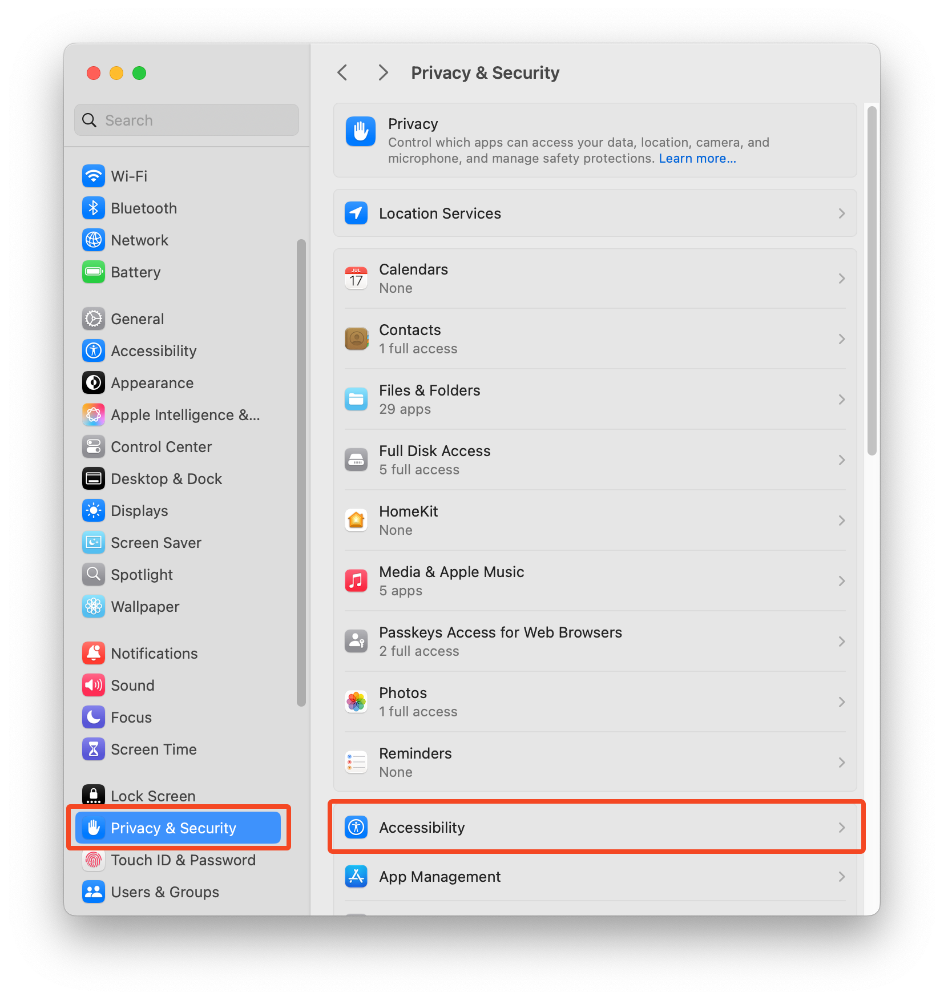
2. Enable **Hammerspoon** if it's not already enabled
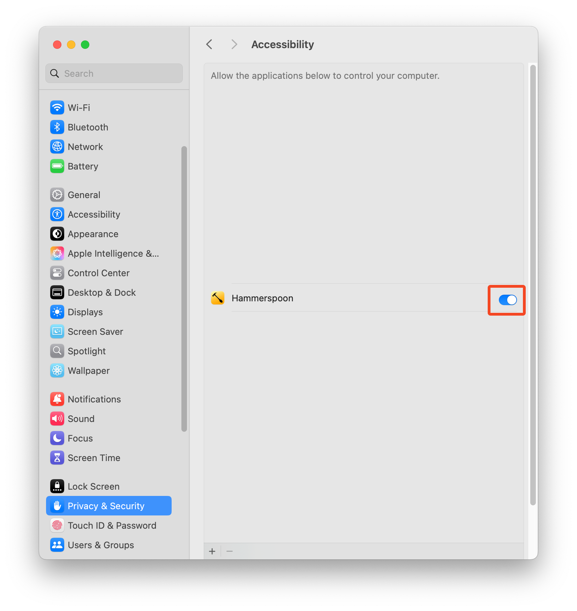
3. You may need to restart Hammerspoon after granting permissions

#### 2. Fabric AI Setup

Fabric AI provides powerful text processing capabilities. To set it up:

##### Run Fabric Setup
```bash
# Open a new terminal window to load the fabric alias
fabric --setup
```

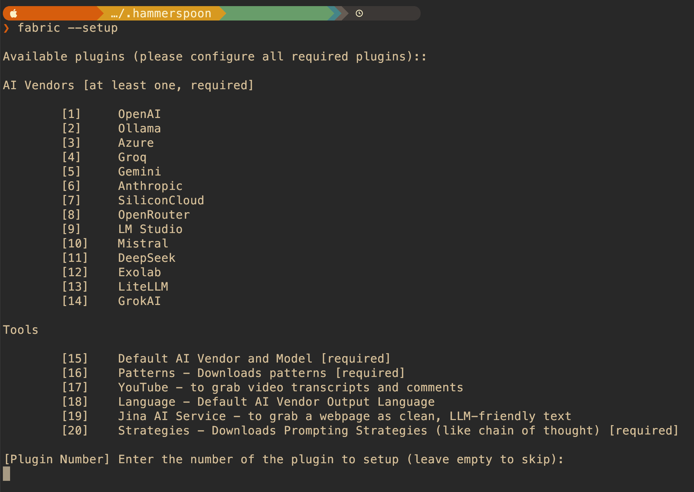

This will guide you through setting up directories and API keys.

##### Get Required API Keys

**Groq API Key (Free & Required)**

Groq provides fast, free AI inference perfect for text processing:

1. Visit [https://console.groq.com/keys](https://console.groq.com/keys)
2. **Login with your Google account**
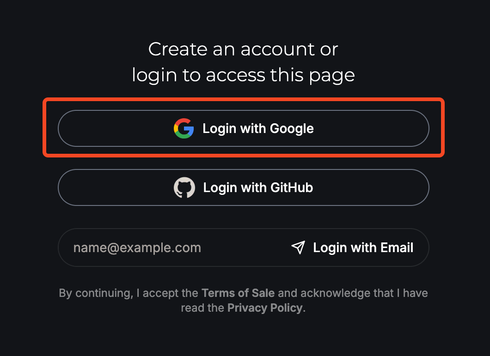
3. Navigate to the API Keys management page
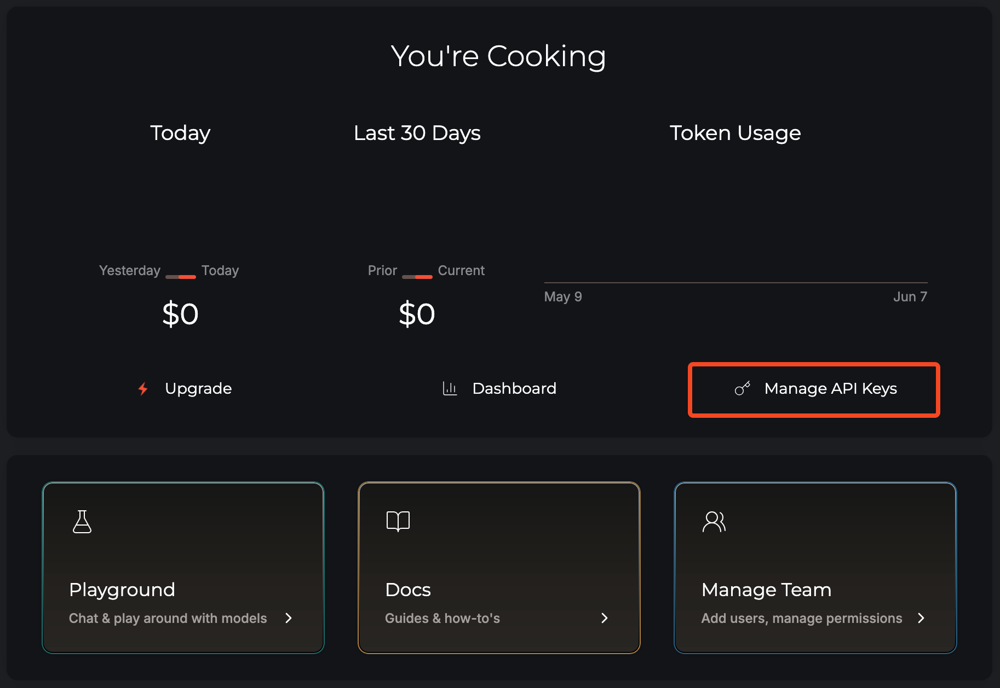
4. Click **"Create API Key"**
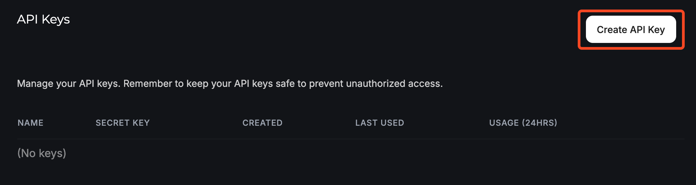
5. Enter a name for your key (e.g., "Hammerspoon Fabric")
6. Click **"Copy"** to copy the API key
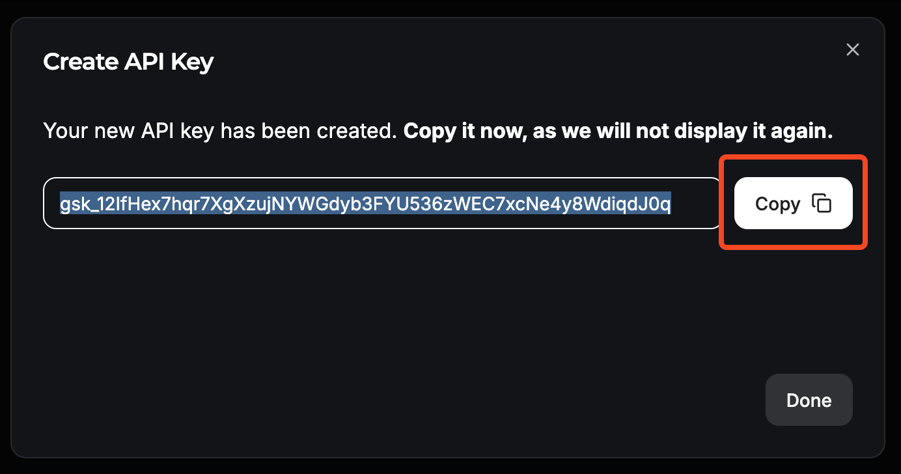
7. Paste it into the **Groq API key section** when running `fabric --setup`

**YouTube API Key (Optional)**

For YouTube-related features (video transcription, etc.):

1. Visit [https://console.cloud.google.com/marketplace/product/google/youtube.googleapis.com](https://console.cloud.google.com/marketplace/product/google/youtube.googleapis.com)
2. Click **"Enable"** to enable the YouTube Data API v3
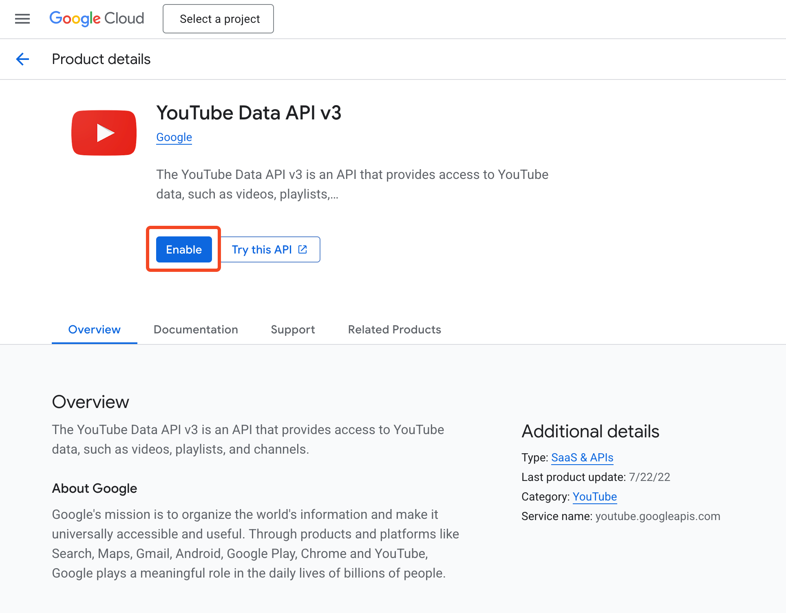
3. Go to **"Credentials"** in the left sidebar
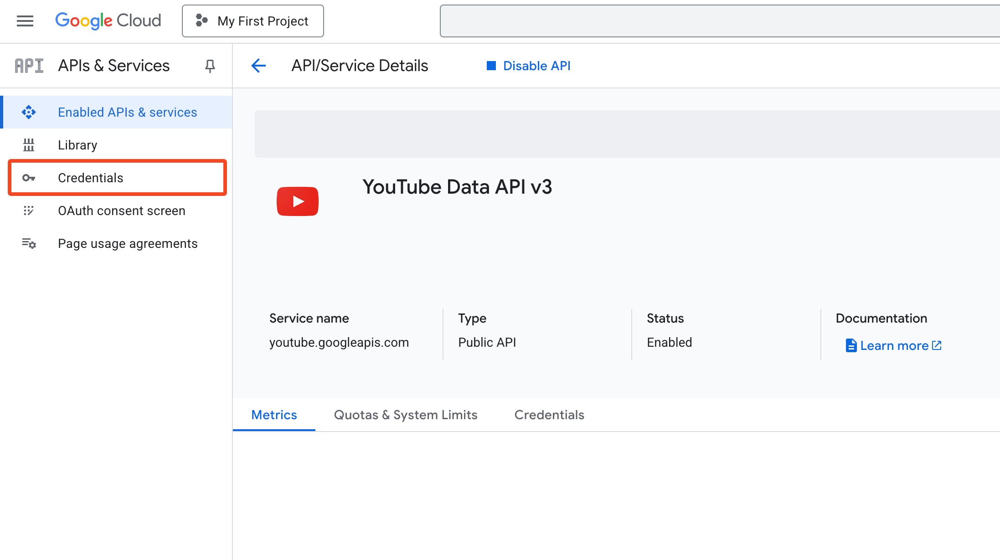
4. Click **"Create Credentials"** and select **"API Key"**
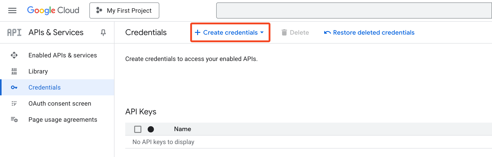
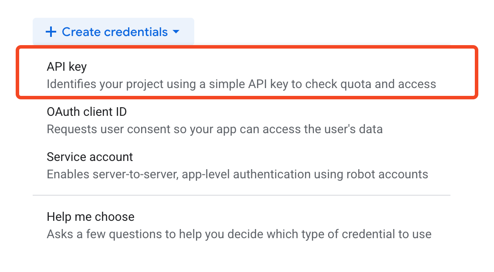
6. Click **"Copy"** to copy the API key
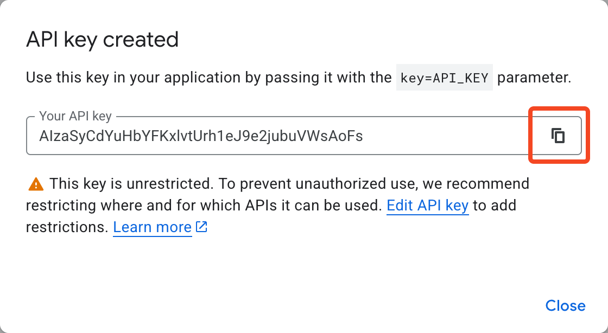
7. Paste it into the **YouTube API key section** when running `fabric --setup`

##### Fabric Configuration

During `fabric --setup`, you'll be prompted to:
- Set up directories (accept defaults)
- Configure AI providers (choose Groq for free usage)
- Enter your API keys
- Set default models

**Recommended Settings:**
- **Default Provider**: Groq
- **Default Model**: llama-3.1-70b-versatile (good balance of speed and quality)

### Initial Configuration

After installation, you should customize the configuration for your system:

1. **Create your user configuration file**:
   ```bash
   open ~/.hammerspoon/config_user.lua
   ```

2. **Update Application Definitions**:
   Edit the `applications` section in `config_user.lua` to match the applications you have installed:

   ```lua
   applications = {
       Browser = "Safari", -- Change to your primary browser
       -- Add more applications as needed
   }
   ```

   You can now also use an extended format for applications that need special handling:

   ```lua
   Emacs = {
       name = "Emacs.app",
       bundleID = "org.gnu.Emacs",
       path = "/Applications/Emacs.app" -- Full path if installed in a non-standard location
   },
   ```

3. **Customize Shortcuts**:
   Modify the shortcut keys in your `config_user.lua` to match your preferences.

4. **Reload Configuration**:
   After making changes, reload your configuration with:
   - **⌘⌃⌥⇧R** (Command + Control + Option + Shift + R)

---

## Manual Installation
If you prefer to install manually:

#### Installing Homebrew
Follow the installation instructions provided on the official [Homebrew website](https://brew.sh/)  
or directly execute the command:  
```bash
/bin/bash -c "$(curl -fsSL https://raw.githubusercontent.com/Homebrew/install/HEAD/install.sh)"
```

1. **Install Hammerspoon**:
   ```bash
   brew install hammerspoon
   ```

2. **Clone this repository**:
   ```bash
   git clone https://github.com/felixleopold/hammerspoon.git ~/.hammerspoon
   ```

3. **Setup Fabric AI** (optional, but recommended for AI features):
    Install Fabric with homebrew and add an alias to `~/.zshrc`
   ```bash
   brew install fabric-ai
   
   # Optional: add an alias if you want to use just "fabric" instead of "fabric-ai"
   echo "alias fabric='fabric-ai'" >> ~/.zshrc
   source ~/.zshrc
   ```
   
   **Important:** Update the fabric path in your config:
   ```lua
   -- In config.lua, change this line:
   fabricPath = "/opt/homebrew/bin/fabric-ai", -- For Homebrew installation
   ```
   
   For more details, see the [Fabric Documentation](https://github.com/danielmiessler/fabric?tab=readme-ov-file#installation)

4. **Move fabric patterns** 
    Overwrite the fabric patterns in `~/.config/fabric/patterns` with the ones from this repository:
    ```bash
    rsync -a ~/.hammerspoon/fabric-patterns/ ~/.config/fabric/patterns/ && rm -rf ~/.hammerspoon/fabric-patterns
    ```

5. **Launch Hammerspoon**:
   ```bash
   open -a Hammerspoon
   ```
   When prompted, grant Hammerspoon the required accessibility permissions in System Settings.

6. **Configure your setup**:
   ```bash
   cp ~/.hammerspoon/config_user.lua.template ~/.hammerspoon/config_user.lua
   open ~/.hammerspoon/config_user.lua
   ```

### Post-Installation Setup
[Post-Installation Setup](#post-installation-setup)

Quick links to guided sections with screenshots:

- Groq key: see [Fabric AI Setup](#fabric-ai-setup) and [Get Required API Keys](#get-required-api-keys)
- YouTube key: see [Get Required API Keys](#get-required-api-keys)


## Key Features

### Window Management

The framework includes advanced window management features with **seamless left-right modifier support**:

**Key Feature**: Use Left Control for window management while preserving all normal system shortcuts (Ctrl+C copy, Ctrl+V paste, etc.)

- **Basic Positioning** (Left Control only):
  - **Left Ctrl + A**: Left half of screen
  - **Left Ctrl + D**: Right half of screen
  - **Left Ctrl + W**: Top half of screen
  - **Left Ctrl + S**: Bottom half of screen
  - **Left Ctrl + C**: Center window
  - **Left Ctrl + F**: Full screen

- **Screen Management**:
  - **⌘⌥A**: Move to previous screen
  - **⌘⌥D**: Move to next screen

### Application Shortcuts

Launch or focus applications with **⌃⌥⌘** (Control + Option + Command) plus a key:
- **⌃⌥⌘Z**: Primary browser
- **⌃⌥⌘C**: Primary editor
- *And more defined in your configuration*

You can also define a second application layer with **⌃⌥⌘⇧** (Control + Option + Command + Shift):

```lua
-- In your config_user.lua
shortcuts = {
  apps2 = {
    { app = "Browser", key = "B" },
    { app = "Editor", key = "E" },
  }
}
```
This uses the `triggers.app2 = { "ctrl", "alt", "cmd", "shift" }` combination by default.

Open specific Finder folders with **⌘⇧** (Command + Shift) plus a key:
- **⌘⇧A**: Applications Folder
- **⌘⇧D**: Desktop Folder
- *And more defined in your configuration*

### Utility Shortcuts

- **⌘⇧X**: Close all Finder windows
- **⌘⇧W**: Close all windows of currect application except for the focused one

### Macro Recording, Chooser, and Timing Editor

The framework includes a macro recording and playback system, plus a chooser and a visual timing editor:

- **⌥⌘[**: Start/stop recording a macro (toggle)
- **⌥⌘]**: Play the most recently saved macro
- **⌥⌘\\**: Open the macro chooser to select and play any saved macro
 - In the chooser, hold **⌥** (Option) when selecting to open the timing editor instead of playing
 - **⌥⌘E**: Open the timing editor directly for the last-selected or most recent macro

When recording, red circles will appear around your mouse cursor whenever you click, and a "Recording Macro..." indicator will be displayed. When playing back, blue circles will highlight clicks.

The timing editor provides a web-based UI to adjust event timings precisely and apply a global playback speed. After edits, timings are persisted to `~/.hammerspoon/macros.json`.

Notes:
- The chooser remembers the last selected macro for quick playback
- Up to 10 macros are stored (oldest removed when full)

The system records mouse movements, clicks, and keyboard inputs with accurate timing. Up to 10 macros can be saved, with the oldest ones being automatically replaced when this limit is reached.

### Fabric Shortcuts
Execute a fabric pattern call on the current clipboard content with **⌃⌥** (Control + Option) plus a key:
- **⌃⌥R**: Correct Pattern
- **⌃⌥M**: Markdown Pattern

You can also open a pattern chooser with **⌘⌥⇧P** (configurable via `fabric.chooserTrigger`/`fabric.chooserKey`).

Recommended defaults (free): Provider Groq, Model `llama-3.1-70b-versatile`.

### App Groups (cycle through related apps)

Define app groups in `config_user.lua` and bind them under `shortcuts.appGroups` to cycle quickly through related apps. Example:

```lua
appGroups = {
    browsers = { apps = { "Browser", "Browser2" }, mode = "recent", launchIfNotRunning = true },
}
shortcuts = {
    appGroups = {
        { group = "browsers", key = "B" },
    },
}
```

### Mouse Speed Finder

Analyze your pointing performance and get suggestions to increase or decrease mouse/trackpad speed, with one-click apply:

- Shows a brief report and suggests a change after every N clicks (configurable)
- Lets you apply the suggested speed immediately and verifies it was set
- Toggle and report shortcuts are configurable under `mousespeedfinder.shortcuts`

### Telemetry (Optional)

Track hotkey usage locally (and optionally to your server):

```lua
telemetry = {
    enabled = true,
    username = nil, -- optional identifier
    serverUrl = nil, -- optional; if set, events are POSTed
    includeAppName = true,
}
```

Notes:
- Local log: `~/.hammerspoon/telemetry_events.jsonl`
- Enable via installer or set the block above in `config_user.lua`

Enable in your `config_user.lua`:

```lua
mousespeedfinder = {
    enabled = true,
    device = "auto", -- or "mouse" | "trackpad"
}
```

### Internal Clipboard History

Access the last 9 copied text items with **⌃⇧1** through **⌃⇧9**

### Kanata Integration

Visual menu bar indicator showing current Kanata keyboard mode:

- **◯ Empty Circle**: Normal mode
- **◆ Diamond**: Vim mode  
- **● Filled Circle**: Typing mode

Update from terminal:
```bash
# Set mode (creates menu bar indicator)
kanata-mode normal
kanata-mode vim
kanata-mode typing

# Check current mode
kanata-mode
```

The indicator automatically updates when the status file changes, making it perfect for integration with your actual Kanata configuration. See [docs/KANATA.md](docs/KANATA.md) for detailed setup instructions.

## Advanced Configuration

For detailed information on the framework's architecture, module development, and advanced configuration, please see the [Developer Guide](gemini.md).

### Adding Custom Shortcuts

To add your own custom shortcuts, you can use the `self.lua` module. Define your functions in `self.lua` and your shortcuts in `config_user.lua`. For a complete guide, refer to the [Developer Guide](gemini.md).

### Extending the Framework

The framework is designed to be modular. You can add your own Lua modules to extend its functionality. See the [Developer Guide](gemini.md) for a step-by-step tutorial on creating new modules.

## Updating

When updating the framework, your personal configuration is preserved:

1. Pull the latest changes:
```bash
cd ~/.hammerspoon
git pull
```

2. If new configuration options are added, they will be available in `config_defaults.lua`.
   You can copy them to your `config_user.lua` if you want to customize them.

3. Check CHANGELOG.md for breaking changes

4. Reload Hammerspoon with **⌘⌃⌥⇧R**

## Troubleshooting

### General Issues

1. **Check the Hammerspoon Console** for errors (Help > Console in Hammerspoon menu)
2. **Verify your configuration** in `config_user.lua`
3. **Look for log messages** from specific modules
4. **Ensure all required applications** are installed and properly named in your config

### Fabric AI Issues

**Fabric shortcuts not working (⌃⌥R, ⌃⌥M):**

1. **Check if Fabric is installed:**
   ```bash
   which fabric
   which fabric-ai
   ```

2. **Test Fabric directly:**
   ```bash
   echo "test text" | fabric --pattern correct
   ```

3. **Check API keys:**
   ```bash
   fabric --setup
   ```
   Re-enter your API keys if needed

4. **Verify Fabric configuration:**
   ```bash
   cat ~/.config/fabric/.env
   ```
   Should contain your API keys

**Common Fabric Error Messages:**

- **"No API key found"**: Run `fabric --setup` and enter your Groq API key
- **"Pattern not found"**: Check if patterns are installed in `~/.config/fabric/patterns/`
- **"Connection error"**: Check your internet connection and API key validity
- **"Rate limit exceeded"**: Wait a few minutes or check your API usage

**Reinstall Fabric patterns:**
```bash
# If patterns are missing or corrupted
cd ~/.hammerspoon
rsync -a fabric-patterns/ ~/.config/fabric/patterns/
```

### Accessibility Permissions

If shortcuts aren't working:

1. **System Settings** > **Privacy & Security** > **Accessibility**
2. **Remove Hammerspoon** from the list (click the minus button)
3. **Restart Hammerspoon** - it will prompt for permissions again
4. **Grant permissions** and test functionality

### Application Shortcuts Not Working

1. **Check application names** in your `config_user.lua`
2. **Use exact application names** as they appear in Applications folder
3. **For non-standard apps**, use the extended format:
   ```lua
   MyApp = {
       name = "MyApp.app",
       bundleID = "com.company.myapp",
       path = "/Applications/MyApp.app"
   }
   ```

### Window Management Issues

1. **Left Control not working**: Check if you have other software intercepting Ctrl key
2. **Windows not positioning correctly**: Some apps don't respond to window management
3. **Multiple monitors**: Ensure your monitor setup is stable before using screen management

### Complete Reset

If everything fails, try resetting Hammerspoon:

```bash
# Backup your custom configuration
cp ~/.hammerspoon/config_user.lua ~/config_user.lua.backup

# Reset Hammerspoon
rm -rf ~/.hammerspoon

# Reinstall using the automated script
curl -fsSL https://raw.githubusercontent.com/felixleopold/hammerspoon/config/install.sh | bash

# Restore your configuration
cp ~/config_user.lua.backup ~/.hammerspoon/config_user.lua

# Reload configuration
# Press ⌘⌃⌥⇧R in Hammerspoon
```

### Getting Help

1. **Check the logs** in Hammerspoon Console
2. **Test individual components** to isolate issues
3. **Verify prerequisites** are installed (Homebrew, Fabric, etc.)
4. **Create an issue** on GitHub with:
   - Your macOS version
   - Hammerspoon version
   - Error messages from console
   - Steps to reproduce the problem

## For Developers

This framework is built with modularity and extensibility in mind. If you want to contribute or customize it further, please read the [Developer Guide](gemini.md), which covers:
- The project's architecture and module structure.
- The configuration system (`config_defaults.lua`, `config_user.lua`, `setup.lua`).
- How to add new modules and custom shortcuts.
- Debugging and logging best practices.

## See Also

- [SHORTCUTS.md](docs/SHORTCUTS.md) - Default keyboard shortcuts
- [CHANGELOG.md](docs/CHANGELOG.md) - Version history
- [Hammerspoon Documentation](https://www.hammerspoon.org/docs/)
